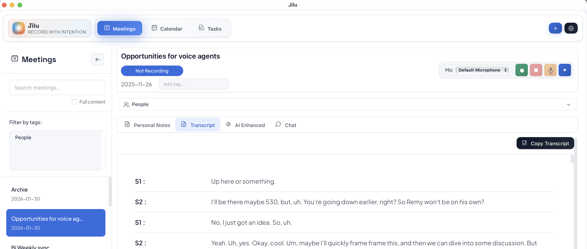

# Jilu - Meeting Memory

> **Record with intention. Remember with AI.**

Jilu (记录 - "to record" in Mandarin) is a mindful meeting recorder for macOS that captures conversations, transcribes them in real-time, and helps you remember what matters with AI assistance.



<p align="center">
  <strong>⚠️ macOS Only</strong>
</p>

---

## 🎯 What is Jilu?

Jilu is a desktop app that:
- **Records** your meetings with system audio and microphone capture
- **Transcribes** in real-time using Speechmatics API
- **Identifies** speakers automatically when you enroll your voice
- **Enhances** notes with AI summaries and action items
- **Syncs** with your macOS Calendar to keep everything organized

Perfect for remote workers, consultants, researchers, and anyone who wants to stay present in conversations without frantically taking notes.

---

## ⚡ Quick Start

### Prerequisites

1. **Speechmatics API Key** - [Get one here](https://portal.speechmatics.com/api-keys) (required)
2. **OpenAI API Key** - [Get one here](https://platform.openai.com/api-keys) (optional, for AI features)
   - Or use a local LLM (Ollama, LM Studio) instead

### Installation

1. **Download** the latest release from the [Releases page](../../releases)
2. **Open** the `.dmg` file and drag Jilu to Applications
3. **Launch** Jilu from Applications
4. **Follow** the onboarding wizard to set up your API keys and preferences

### First Recording

1. Click **"New Meeting"** or press `⌘⇧M`
2. Enter your API keys when prompted
3. Click the **🎤 microphone button** to start recording
4. Speak naturally - the transcript appears in real-time
5. Click **⏹️ stop** when done
6. Click **✨ Enhance with AI** to generate summaries and action items

---

## ✨ Key Features

### 🎤 Real-Time Transcription
- Live transcription powered by Speechmatics
- Speaker identification (when you enroll your voice)
- Custom dictionary for company names and jargon

### 📝 Smart Note Taking
- Rich text editor for personal notes
- AI-enhanced summaries with customizable templates
- Chat interface to ask questions about your meetings

### 📅 Calendar Integration
- Syncs with macOS Calendar (Google, Outlook, iCloud)
- Desktop notifications before meetings
- Automatically links notes to calendar events

### ✅ Task Management
- Extract action items from meetings
- Due dates and filtering
- Drag-and-drop prioritization

### 🔐 Privacy First
- All meeting data stored locally on your device (IndexedDB)
- Only audio transcription sent to Speechmatics
- AI processing uses OpenAI or your local LLM
- No cloud storage, no tracking

---

## 🔧 Setup & Configuration

### Audio Setup

Jilu captures audio from:
1. **System Audio** - Everything your Mac plays (Zoom, browser, etc.)
2. **Microphone** - Your voice for hybrid meetings

The app uses macOS ScreenCaptureKit to capture system audio. Just grant permissions when prompted - no additional software needed.

### Voice Enrollment (Optional)

To get your name on transcripts instead of "Speaker 1":

1. Go to **Settings → General → Voice ID**
2. Enter your name
3. Click **"Record 15s sample"** and read the script
4. Click **"Enroll voice with Speechmatics"**

Enroll samples from each microphone you use (laptop, headset, etc.) for best results.

### Calendar Sync (Optional)

1. Make sure your Google/Outlook accounts are added in **System Settings → Internet Accounts**
2. Open Apple Calendar app once to let it sync
3. In Jilu, go to **Settings → Calendar**
4. Click **"Grant Permission"** for calendar access
5. Enable sync and choose which calendars to track

### AI Provider Setup

**Option A: OpenAI**
- Add your API key in Settings → General → Audio & AI
- Works out of the box

**Option B: Local LLM** (Free)
1. Install [Ollama](https://ollama.ai) or [LM Studio](https://lmstudio.ai)
2. In Settings → General → Audio & AI:
   - OpenAI Endpoint: `http://localhost:11434/v1` (Ollama) or `http://localhost:1234/v1` (LM Studio)
   - Model Name: Your local model (e.g., `llama2`, `mistral`)
   - Leave API key empty

---

## ⌨️ Keyboard Shortcuts

| Shortcut | Action |
|----------|--------|
| `⌘⇧M` | New Meeting (global) |
| `⌘S` | Save current meeting |
| `⌘F` | Search meetings |
| `⌘K` | Quick command palette |
| `⌘⇧K` | Toggle mute (customizable) |
| `⌘/` | Toggle sidebar |

Customize shortcuts in Settings → General → Keyboard Shortcuts

---

## 🛠️ Building from Source

### Requirements
- Node.js 18+
- Rust 1.70+
- Xcode Command Line Tools/VScode

### Local signing (optional)
By default, the public `src-tauri/tauri.conf.json` is sanitized and builds without a personal signing identity. If you want to sign/notarize locally, create a private config and use it when building:

1. Copy the example config:
```bash
cp src-tauri/tauri.conf.local.example.json src-tauri/tauri.conf.local.json
```
2. Edit `src-tauri/tauri.conf.local.json` with your own `identifier` and `signingIdentity`.
3. Build using the local config:
```bash
npm run tauri build -- --config src-tauri/tauri.conf.local.json
```

### Steps
```bash
# Clone the repository
git clone https://github.com/yourusername/jilu.git
cd jilu

# Install dependencies
npm install

# Run in development mode
npm run tauri dev

# Build for production
npm run tauri build
```

The built app will be in `src-tauri/target/release/bundle/`.

---

## 🐛 Troubleshooting

### No transcription appearing
- Verify your Speechmatics API key is correct
- Check your internet connection
- Ensure audio is playing through your Mac
- Look for errors in Settings → Check browser console

### Calendar not syncing
- Open Apple Calendar app and verify events appear there
- Check Jilu has calendar permission in System Settings → Privacy & Security → Calendar
- Try clicking "Sync Now" in Settings → Calendar

### AI features not working
- Verify OpenAI API key (or local LLM is running)
- Check you have transcripts or notes to enhance
- For local LLMs, ensure the endpoint is correct and model is running

### App crashes or freezes
- Check Console.app for crash logs
- Try resetting settings (back up data first)
- Report issues on GitHub with logs

For more help, [open an issue](../../issues) on GitHub.

---

## 🤝 Contributing

Contributions are welcome! Whether you're fixing bugs, adding features, or improving docs, we appreciate your help.

Before contributing:
1. Read [CONTRIBUTING.md](CONTRIBUTING.md)
2. Check existing [issues](../../issues) and [pull requests](../../pulls)
3. Open an issue to discuss major changes before implementing

---

## 📋 Roadmap

**Completed** ✅
- Real-time transcription with Speechmatics
- Speaker identification and voice enrollment
- AI-powered summaries and chat
- Calendar integration with reminders
- Task management
- Custom prompt templates
- Auto-export to markdown files
- Dark mode UI

Have ideas? [Open a feature request](../../issues)!

---

## 📄 License

This project is licensed under the MIT License - see [LICENSE](LICENSE) for details.

### ⚠️ Important Disclaimer

**This software was primarily developed with assistance from Large Language Models (LLMs).**

- The code may contain bugs, errors, or security vulnerabilities
- No warranty or guarantee is provided for fitness for any purpose
- Users are responsible for reviewing and validating the software
- Use at your own risk
- Always review code before using in production environments

See [LICENSE](LICENSE) for full details.

---

## 🙏 Acknowledgments

Built with:
- [Tauri](https://tauri.app/) - Desktop app framework
- [Speechmatics](https://www.speechmatics.com/) - Real-time transcription
- [OpenAI](https://openai.com/) - AI language models
- [Vite](https://vitejs.dev/) - Frontend build tool
- [TipTap](https://tiptap.dev/) - Rich text editor

Special thanks to:
- The Tauri community for an amazing framework
- Speechmatics for accurate transcription
- All contributors and early testers

---

## 💬 Support & Community

- 🐛 **Bug Reports**: [Open an issue](../../issues)
- 💡 **Feature Requests**: [Start a discussion](../../discussions)

---

<p align="center">
  Made with ❤️ by humans and AI<br>
  <em>"In Mandarin, jilu (记录) means to record - let's honour every word."</em>
</p>
